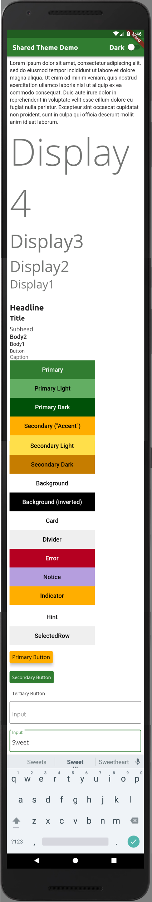
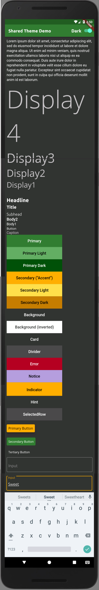
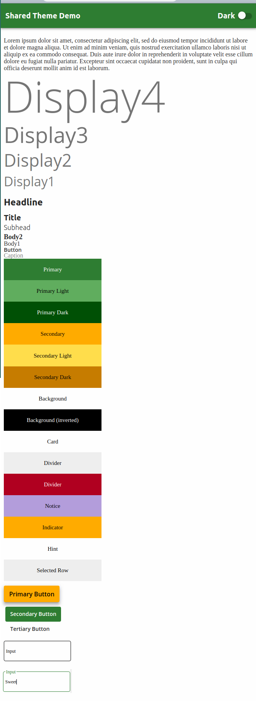
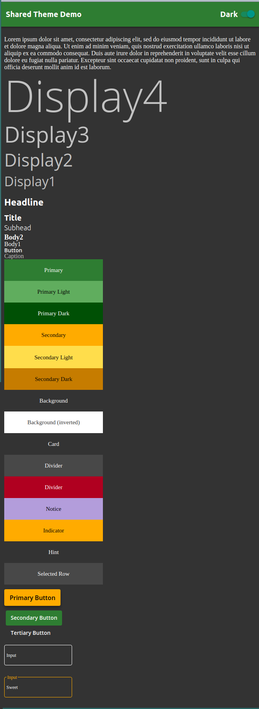

# Shared Theme

Easily share a theme between Flutter and the web.

## Synopsis

A `Theme` is a `ColorSet`, `FontSet`, and an `ElementSet`, which
are abstract containers for defining properties such as border, padding, etc.

Themes are typically combined into a single `ThemeSet` per application. ThemeSet adds support for bundled `FontFace`s, and `ThemeSet.toString()` returns an SCSS string that fully represents it.

In Flutter, a Theme is converted into Flutter's ThemeData by using the `shared_theme_flutter` package's `themeData()` function.

## Example

There is a complete [example](https://github.com/jifalops/shared_theme/tree/master/example)
included, and in particular, see its
[ThemeSet definition](https://github.com/jifalops/shared_theme/blob/master/example/packages/base/lib/themes.dart).

<!-- ## [Tutorial, How-to, and explanation](doc/) -->

## Screenshots

Mobile light | Mobile dark
-|-
 | 

Web light | Web dark
-|-
 | 

